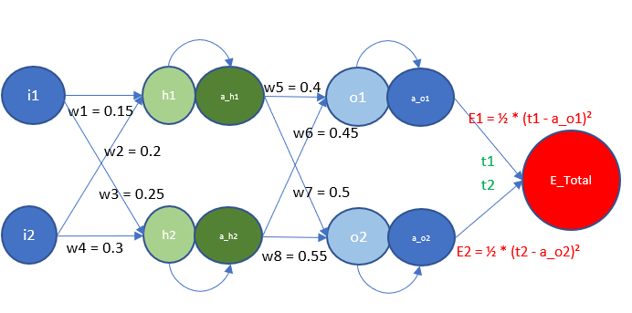

#  leveraging Neural Network by Excel 

In this guide, we're going to walk through the steps of creating a neural network that utilizes backpropagation, all within Excel. By leveraging Excel's built-in formulas and functions, we'll construct a straightforward and functional neural network model. Throughout the tutorial, we aim to demystify the fundamental principles that drive neural networks and the backpropagation algorithm, making sure each explanation is accessible and easy to grasp.

# Therotical 

**Activation Function:**
An activation function in a neural network serves as a critical non-linear transformation that allows the network to learn complex patterns. It decides whether a neuron should be activated or not, determining the output of that neuron given a set of inputs. Common activation functions include the sigmoid, which squashes output values to a range between 0 and 1; the hyperbolic tangent (tanh), which outputs values between -1 and 1; and the Rectified Linear Unit (ReLU), which outputs the input directly if it is positive, otherwise, it will output zero. Activation functions are not only pivotal for learning complex patterns but also for introducing non-linearity to the model, making it capable of learning from and performing tasks on a wide range of data.

**Forward Propagation:**
Forward propagation is the initial phase of the learning process in a neural network where input data is passed through the network's layers to generate an output. In this phase, the input data is processed layer by layer, from the input layer through the hidden layers and finally to the output layer. At each neuron, an activation function is applied to the weighted sum of the inputs, and the result is forwarded to the next layer. The final output is then used to calculate the error of the network's prediction, which forms the basis for the subsequent backward propagation phase.

**Backward Propagation:**
Backward propagation, or backpropagation, is the second phase of the learning process in neural networks, following forward propagation. It is where the network learns by adjusting the weights of the neurons. Backpropagation computes the gradient of the loss function (a measure of the error) with respect to each weight by the chain rule, propagating the error backward through the network. Starting from the output layer and moving backward to the hidden layers, the algorithm calculates the contributions of each neuron to the error and updates the weights to minimize the loss function. This process allows the network to improve its predictions during training.

# pratical 

Below I will illustrate a simple feedforward neural network architecture and the backpropagation process used for training such networks. I will be using above image to example the process.

**Our input values for i1 = 0.05 and i2 = 0.1 and the target value t1 = 0.5 and t2 = 0.5 are fixed.**  
**Weights: W1=0.15,W2=0.2,W3=0.25,W4=0.3,W5=0.4,W6=0.45,W7=0.5,W8=0.55** 
**Activation Function: σ(x) = 1/(1 + exp(-x))**

1. Forward Propagation: This is the process where input values are fed into the neural network and passed through the layers to produce an output. In this network, the inputs are passed through the weights to the hidden layer, and then the results are passed forward again to the output layer. The circles labeled i1 and i2 represent the input neurons. The circles labeled h1 and h2 represent hidden neurons, and o1 and o2 are the output neurons. Each neuron in one layer is connected to every neuron in the next layer, indicating a fully connected network.  The lines connecting the neurons have associated weights (w1 to w8), which are the parameters that the network will learn. These weights determine the strength and direction (positive or negative influence) of the connection between neurons. The hidden and output neurons have activation functions (not specified in the image), which are mathematical equations that determine the output of a neural network node given an input or set of inputs. The activations (a_h1, a_h2, a_o1, a_o2) represent the output of the neurons after the activation function has been applied.

According to the formula : h1 = w1*i1 + w2*i2 = 0.15*0.05+0.2*0.1 = 0.0275 \n
h2 = w3*i1 + w4*i2	= 0.25*0.05+0.4*0.1 = 0.0425

Now we will apply activation function to a_h1 and a_h2:
a_h1 = σ(h1) = 1/(1 + exp(-h1))	= 0.5068 	
a_h2 = σ(h2) = 1/(1 + exp(-h2))	= 0.5106

Again, we will repeated the same steps:

o1 = w5*a_h1 + w6*a_h2	= 	0.432530357
o2 = w7*a_h1 + w8*a_h2	=   0.534280154
 
a_o1 = σ(o1)	= 	0.606477732
a_o2 = σ(o2)	=   0.630480835

2. Error Calculation: E1 and E2 represent the errors for each output neuron. The error is calculated as the difference between the target output (t1, t2) and the actual output from the network (a_o1, a_o2). The formula 1/2 * (target - output)^2 is a common way to calculate the error in regression tasks; it's called the mean squared error (MSE). The factor of 1/2 is used for mathematical convenience when taking derivatives.

E_total = E1 + E2		
E1 = ½ * (t1 - a_o1)²		
E2 = ½ * (t2 - a_o2)²

3. Backpropagation: This is the training process where the error from the output layer is propagated back through the network to adjust the weights. The objective is to minimize the total error (E_Total), which is the sum of the individual errors from each output neuron (E1 + E2). The adjustments are made according to the derivative of the error with respect to each weight, which informs how the weights need to change to reduce the error.

4. Learning: Through many iterations of forward propagation and backpropagation, with continual adjustments to the weights, the neural network 'learns' the correct mappings from inputs to outputs, ideally minimizing the error across all training examples.

	

		

	
		

# Learning Rate:

  <figure>
    
    <figcaption>LR: 0.1</figcaption>
  </figure>
  <figure>
    
    <figcaption>LR: 0.2</figcaption>
  </figure>
  <figure>
    
    <figcaption>LR: 0.5</figcaption>
  </figure>
  <figure>
    
    <figcaption>LR: 0.8</figcaption>
  </figure>
  <figure>
    
    <figcaption>LR: 1.0</figcaption>
  </figure>
  <figure>
    
    <figcaption>LR: 2.0</figcaption>
  </figure>

